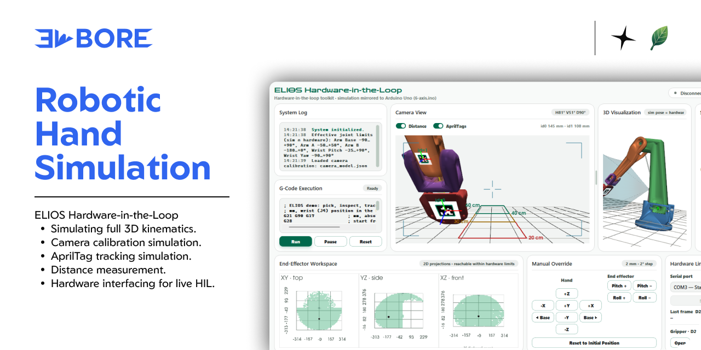

# ELIOS — 5-DOF Robotic Arm Simulation & HIL Toolkit

A 3D kinematic simulator and hardware-in-the-loop (HIL) toolkit for **ELIOS**, a
5-degree-of-freedom robotic arm built for waste sorting. The simulator renders
the arm's STL geometry in real time, solves inverse kinematics for end-effector
control, and mirrors every pose to a real Arduino-driven arm over serial —
with a simulated-camera calibration pipeline to match.

## Features

- **3D arm simulation** (`arm-sim-end.py`) — PyVista/VTK render of the 5-DOF
  arm from STL parts, driven by game-like translation/rotation controls.
  Inverse kinematics (Jacobian pseudoinverse) solves joint angles from a
  target end-effector pose; live panels show end-effector position and joint
  angles.
- **Hardware-in-the-loop toolkit** (`arm-hil-toolkit.py`, `hil_toolkit/`) — a
  PyQt5 desktop app that runs the simulator and streams each pose to an
  Arduino Uno over serial, plus a G-code interpreter/runner, joint graphs, and
  a calibration workflow, all built on the same sim.
- **Camera calibration** (`calibration.py`) — closed-form intrinsic/extrinsic
  camera calibration (Spong, Hutchinson & Vidyasagar, *Robot Modeling and
  Control*, Appendix E), camera-agnostic — consumes correspondences from
  either the simulated camera view or a real camera. The startup procedure
  runs a real-arm-safe G-code that shows the hand's AprilTag to the camera and saves
  a ground-truth file to check the real run against.
- **G-code interpreter** (`hil_toolkit/gcode.py`) — drives the wrist through
  linear/arc moves and gripper commands, in sim and on hardware.

## Repository layout

```
arm-sim-end.py          Standalone 3D simulator (IK end-effector control)
arm-hil-toolkit.py       HIL app entry point (sim + serial + calibration)
calibration.py           Camera calibration solver (book-derived, sim-agnostic)
hil_toolkit/             HIL application package
  app.py                   QApplication wiring / entry point
  main_window.py           Main application window
  sim_loader.py            Loads arm-sim-end.py as a library (headless)
  hardware_mapping.py      Sim -> servo mapping, effective joint limits
  calibration_camera.py    Simulated-camera correspondence generator
  tag_calibration.py       Startup calibration: gripper AprilTag + G-code -> ground truth
  serial_link.py           pyserial line-protocol wrapper
  gcode.py                 G-code interpreter + timed runner
  dialogs.py               Joint-graph and calibration dialogs
  widgets.py                Reusable Qt/VTK widgets
  theme.py                 Design tokens & Qt stylesheets
  paths.py                 Filesystem locations
  tags_toolkit/            AprilTags on the arm
    apriltag.py              Detection + pose (standalone webcam test tool)
    tag_model.py             Mounted tags: link, home pose, size -> ground-truth pose
    sim_tags.py              Textured tags in the simulated views/camera
arms/                     STL geometry for each arm segment, camera, FOV cone
slave_code/               Arduino firmware (5-axis and 6-axis variants)
calibration/              Camera model, correspondences, AprilTag ground truth (generated)
docs/                      Kinematics, calibration, and design reference docs
paper/                    Typst write-up
arm-sim-mapping-calculation.ipynb   Kinematics derivation notebook
Kinematics.xlsx           Sim <-> servo axis mapping reference
```

## Setup

Requires Python 3.11+ (developed on 3.13).

```bash
pip install -r requirements.txt
```

## Usage

**Simulator only** (no hardware needed):

```bash
python arm-sim-end.py
```

**Full HIL toolkit** (simulator + Arduino over serial + calibration):

```bash
python arm-hil-toolkit.py
```

Flash the matching firmware from `slave_code/` (`6-axis/6-axis.ino` by
default) to an Arduino Uno first. The serial protocol is a single line of six
comma-separated integer degrees:

```
D2,D3,D4,D5,D6,D8\n
```

mapping to Gripper, Wrist Yaw, Wrist Pitch, Arm B, Arm A, and Base
respectively. An empty field detaches that servo; every frame carries all six
values. The sim-to-servo mapping is derived from `Kinematics.xlsx` — see
`hil_toolkit/hardware_mapping.py`.

## Documentation

- [`docs/kinematics.md`](docs/kinematics.md) — joint table, link offsets, and
  coordinate conventions.
- [`docs/calculation.md`](docs/calculation.md) /
  [`docs/calculation_indonesia.md`](docs/calculation_indonesia.md) — full
  kinematics derivation (EN/ID).
- [`docs/camera_calibration.md`](docs/camera_calibration.md) — the closed-form
  calibration method implemented in `calibration.py`.
- [`docs/DESIGN.md`](docs/DESIGN.md) — visual design system for the ELIO
  product UI.
- [`arm-sim-mapping-calculation.ipynb`](arm-sim-mapping-calculation.ipynb) —
  worked notebook deriving the joint/link geometry from the raw STL datums.

## Credits

The mechanical arm design (`arms/*.stl`) is by **Emre Kalem** (Makerworld) and
remains subject to its original license on Makerworld — it is not covered by
this repository's MIT license. Kinematics, simulation, calibration, and HIL
tooling by **Reza Fauzan Zulkarnaen**.

## License

MIT — see [LICENSE](LICENSE). The STL arm design is excluded; see Credits
above.
